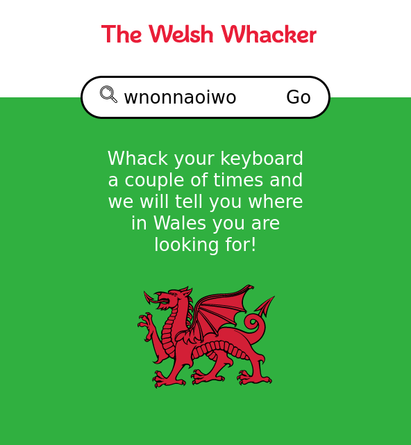

Part of an [advertising pitch to Visit
Wales](https://www.helenandphil.co.uk/visit-wales) designed by by [Helen +
Phil](https://www.helenandphil.co.uk). ‘The Welsh Whacker’ takes the stress out
of trying to spell Welsh towns. It matches any search to the Welsh destination
with the closest spelling!

I built the Welsh Whacker as a single page application using the [elm
programming language](https://elm-lang.org/). I took special care to encode all
necessary state in the page URL so that links can be effortlessly shared.

